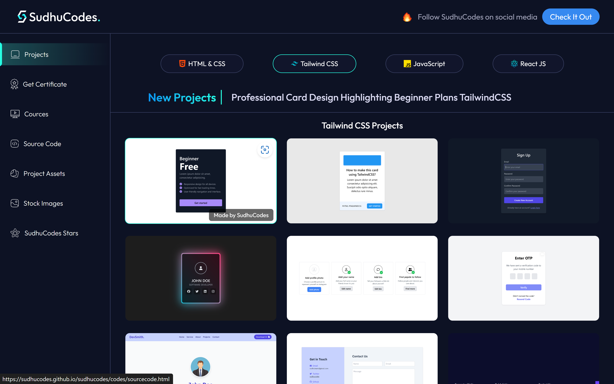

# SudhuCodes Main Website 🌐  

Welcome to the **SudhuCodes Portfolio Website** – a personal portfolio and project showcase developed with HTML, CSS, and JavaScript. This site presents **projects, certificates, courses, and downloadable assets** for aspiring developers.

## Table of Contents  
- [Overview](#overview)  
- [Features](#features)  
- [Technologies Used](#technologies-used)  
- [How to Use](#how-to-use)  
- [File Structure](#file-structure)  
- [Installation and Setup](#installation-and-setup)  
- [Contributing](#contributing)  
- [Contact](#contact)  

---

## Overview  
This portfolio website reflects **SudhuCodes' work** and helps users explore projects, access free downloadable assets, get certified, and interact via quizzes. With an intuitive UI and **responsive design**, the website ensures seamless navigation across all screen sizes.

---

## Features  
- **Projects Section:** Browse HTML, CSS, Tailwind, JavaScript, and React projects.  
- **Get Certificate:** Complete quizzes and receive certificates to showcase skills.  
- **Courses:** Explore free or premium courses to learn new technologies.  
- **Source Code:** Access source code for projects with advanced search functionality.  
- **Project Assets & Stock Images:** Download relevant assets and images directly.  
- **Social Media Integration:** Stay connected via Instagram, YouTube, and GitHub.  
- **Mobile-Friendly Navigation:** Hamburger menu with toggle animation on mobile.  
- **What’s New Popup:** Displays recent updates and versions dynamically.

---

## Technologies Used  
- **Frontend:** HTML, CSS, Tailwind CSS, JavaScript  
- **Fonts:** [Google Fonts - Outfit](https://fonts.google.com/specimen/Outfit)  
- **Icons:** Font Awesome and custom image icons  
- **Hosting:** GitHub Pages

---

## How to Use  
1. **Explore Projects:** Navigate to the **Projects** section and filter by HTML, Tailwind CSS, JavaScript, or React projects.  
2. **Download Assets:** Visit the **Project Assets** section, search for projects, and download relevant materials.  
3. **Earn a Certificate:** Complete the provided quizzes in the **Get Certificate** section to earn a certificate.  
4. **Search Source Code:** Use the search functionality in the **Source Code** section to find projects by name.  
5. **Follow SudhuCodes:** Click on the **Instagram, YouTube, or GitHub** links to stay connected and receive updates.

---

## File Structure  
```bash
SudhuCodes-Portfolio/
│
├── index.html               # Main HTML file  
├── css_files/
│   └── style.css            # CSS styling file  
├── images/
│   ├── logo/                # Logos and branding images  
│   ├── icons/               # Icons used across the site  
│   └── stock/               # Stock images  
├── js/
│   └── script.js            # Main JavaScript functionality  
└── README.md                # Project documentation  
```

---

## Installation and Setup  
To set up the project locally, follow these steps:

1. **Clone the repository:**  
   ```bash
   git clone https://github.com/sudhucodes/sudhucodes-portfolio.git
   cd sudhucodes-portfolio
   ```

2. **Open the project:**  
   Open `index.html` in any browser to preview the site.

3. **Customize content:**  
   Update the content in `index.html` or modify the styles in `css_files/style.css` to fit your requirements.

---

## Contributing  
Contributions are welcome! If you have suggestions or want to add new features:

1. Fork the project.  
2. Create a new branch:  
   ```bash
   git checkout -b feature-new-section
   ```
3. Commit your changes:  
   ```bash
   git commit -m "Added a new section"
   ```
4. Push to the branch:  
   ```bash
   git push origin feature-new-section
   ```
5. Create a pull request.

---

## Contact  
Developed and maintained by **SudhuCodes**.  

- **GitHub:** [SudhuCodes](https://github.com/sudhucodes)  
- **Instagram:** [@sudhucodes](https://instagram.com/sudhucodes)  
- **YouTube:** [SudhuCodes Channel](https://www.youtube.com/@sudhucodes)  
- **Email:** [sudhuteam@gmail.com](mailto:sudhuteam@gmail.com)

---

This project is licensed under the MIT License - feel free to use and modify it as per your needs.

---

## Screenshots  
  

---

Feel free to reach out for collaborations or suggestions!